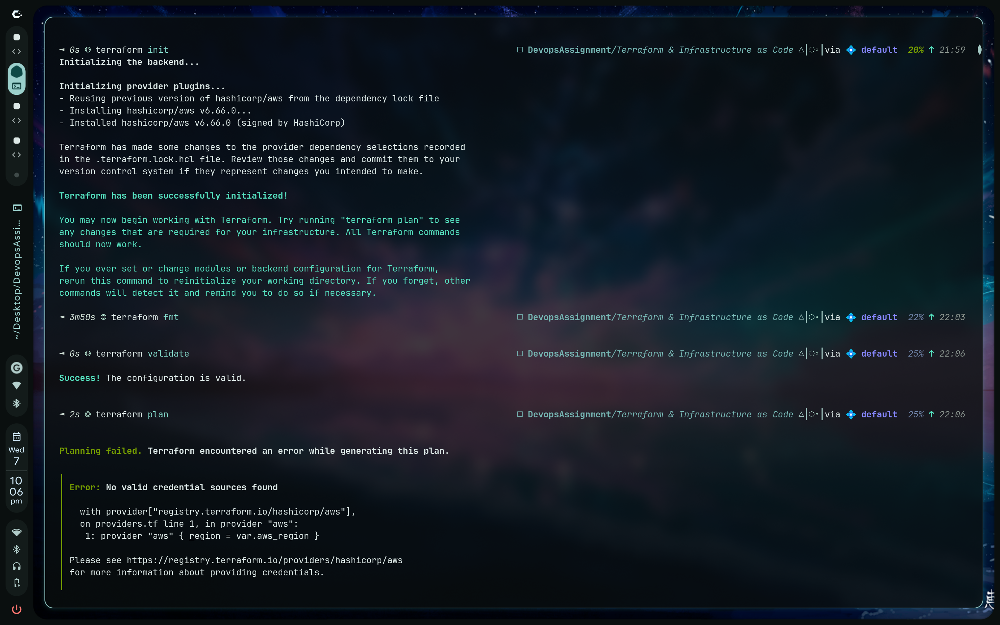

Task 1 :

terraform init :	Initializes a Terraform project. Downloads providers, modules, and sets up the backend. Run this first in a new project.

terraform fmt :	Formats Terraform (.tf) files according to Terraform style conventions. Improves readability and consistency.

terraform validate :	Checks whether the Terraform configuration syntax is valid and internally consistent. Does not contact cloud providers.

terraform plan :	Creates an execution plan showing what Terraform will create, update, or destroy without actually making changes.

terraform apply :	Applies the changes from the plan and creates/modifies infrastructure.

terraform show :	Displays the current Terraform state or a saved plan in a human-readable format.

terraform output :	Shows the values defined in output blocks (e.g., instance IPs, URLs, IDs).

terraform destroy :	Removes all infrastructure managed by the current Terraform configuration.

