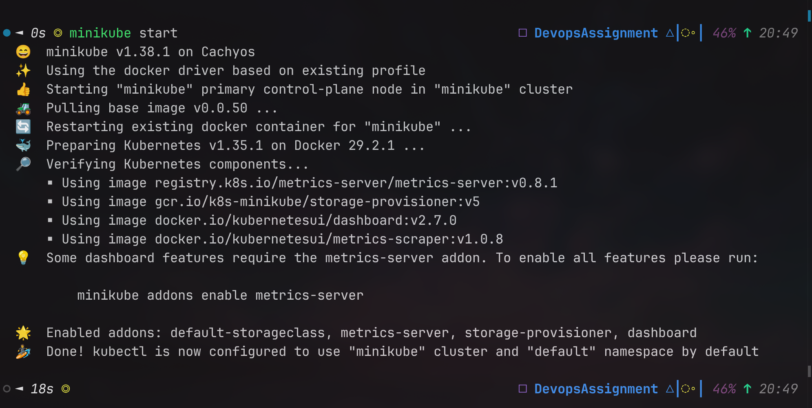
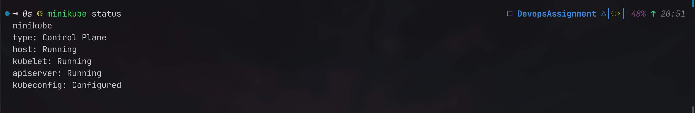
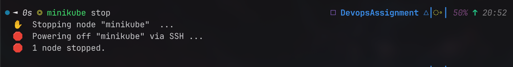

minikube start - starts a local Kubernetes cluster using Minikube. This command initializes the cluster and sets up the necessary components to run Kubernetes on your local machine.

minikube status  - displays the current status of the Minikube cluster, including information about the cluster's components, such as the Kubernetes version, the status of the nodes, and whether the cluster is running or stopped.

minikube stop - stops the Minikube cluster, effectively shutting down the Kubernetes environment. This command is useful when you want to free up system resources or temporarily halt the cluster without deleting it.

Control Plane (Master)

The Control Plane manages the entire Kubernetes cluster and makes decisions about scheduling, scaling, and maintaining applications.

Components:

API Server (kube-apiserver)
Entry point to the cluster.
Receives all commands from users and components.
etcd
Distributed key-value database.
Stores cluster state and configuration.
Scheduler (kube-scheduler)
Decides which worker node should run a newly created Pod.
Controller Manager (kube-controller-manager)
Runs controllers that ensure the actual cluster state matches the desired state.
Example: Creates new Pods if some fail.

Worker Node

Worker nodes are machines where application containers actually run.

Components:

Kubelet
Agent running on each node.
Communicates with the API Server.
Ensures Pods are running as expected.
Container Runtime
Runs containers.
Examples: containerd, CRI-O.
Kube Proxy
Handles networking and load balancing for Pods and Services.
Pods
Smallest deployable unit in Kubernetes.
Contain one or more containers.

