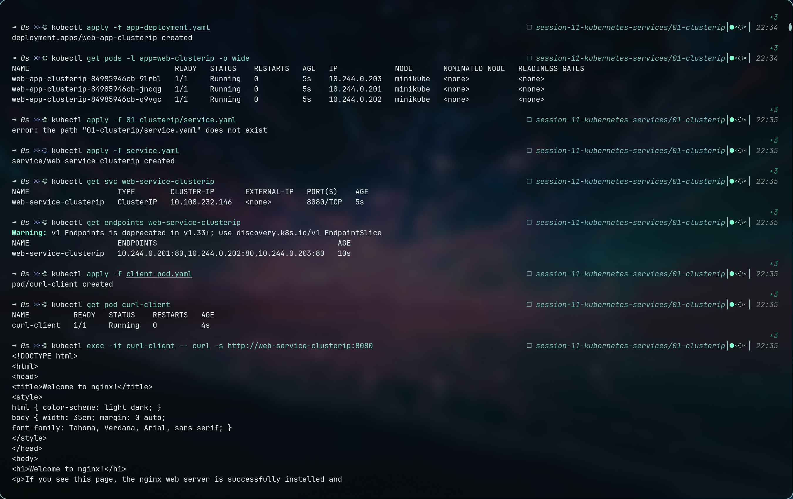
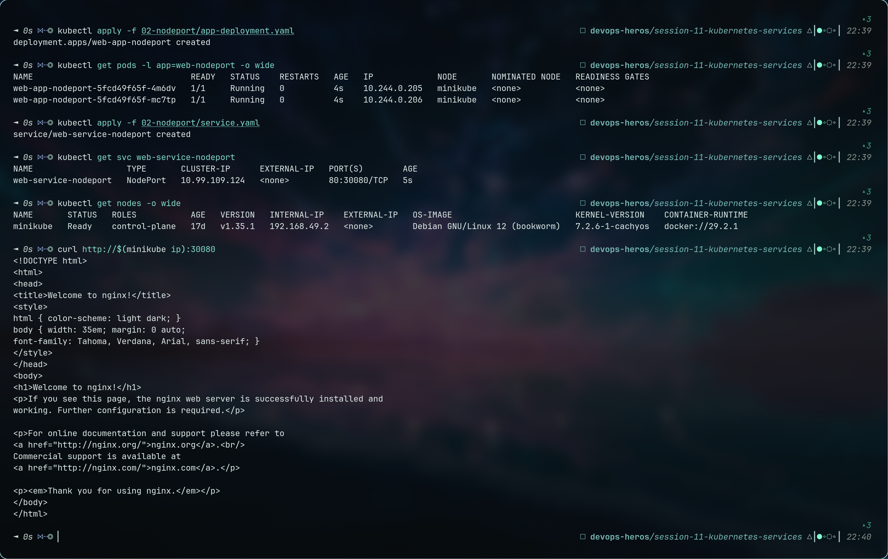
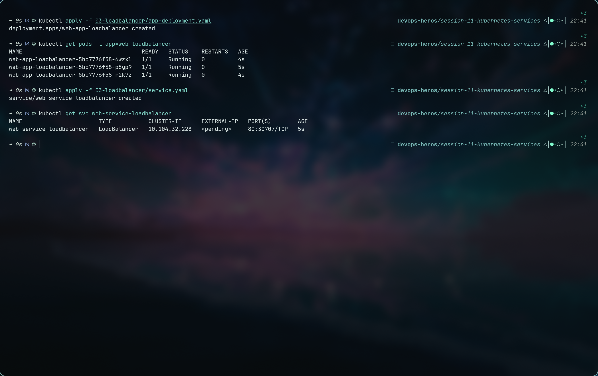
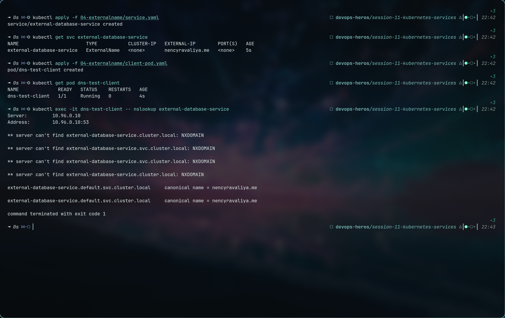
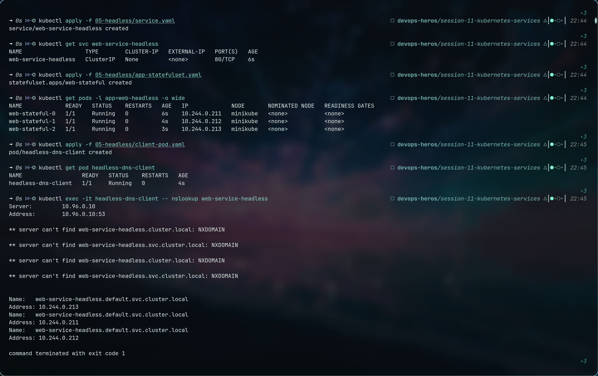
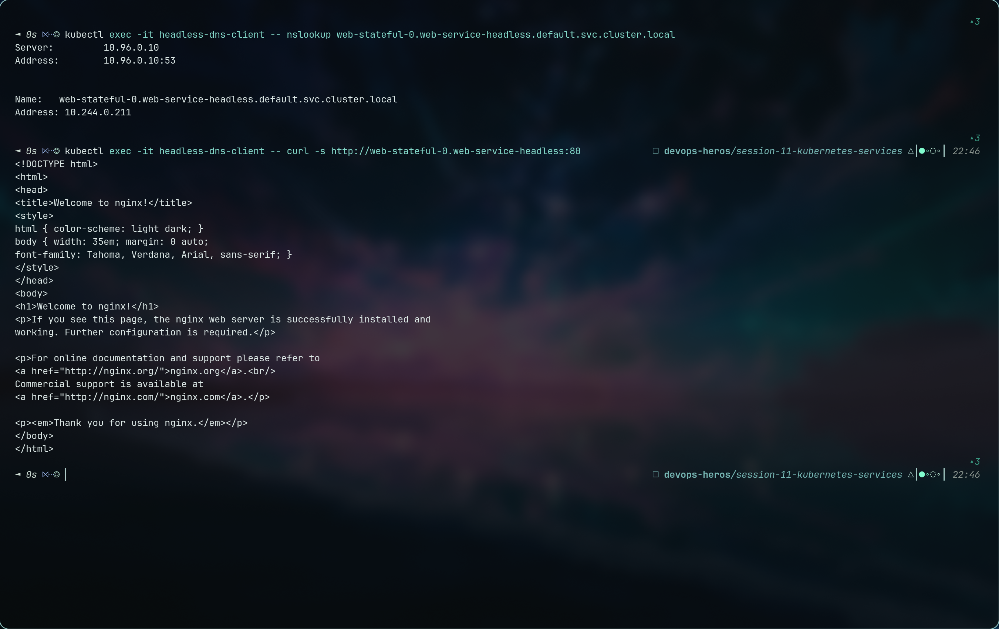

1. ClusterIP — Internal Communication

2. NodePort — External Communication

3. LoadBalancer — External Communication with Load Balancer

4.externalName — External Communication with DNS

5. headless — Internal Communication without ClusterIP

