Rollout Deployment - Rollout is a process of updating the application to a new version without downtime. In Kubernetes, we can perform a rollout deployment using the `kubectl rollout` command.
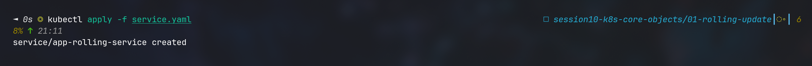
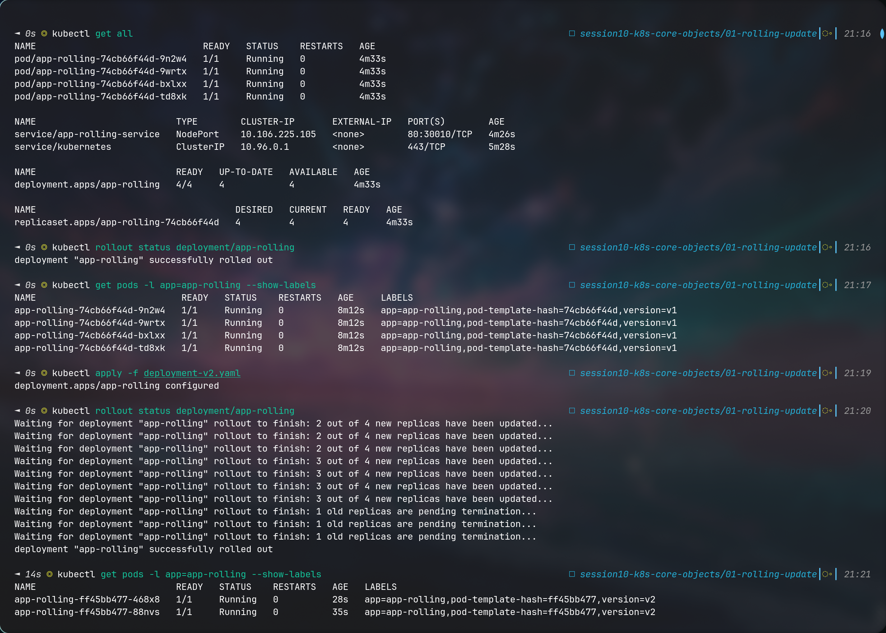
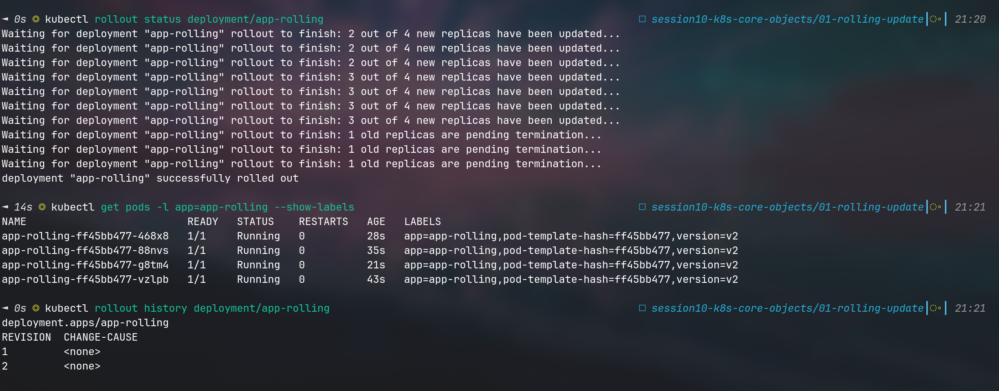
v1
![] (rollout/image.png)
v2
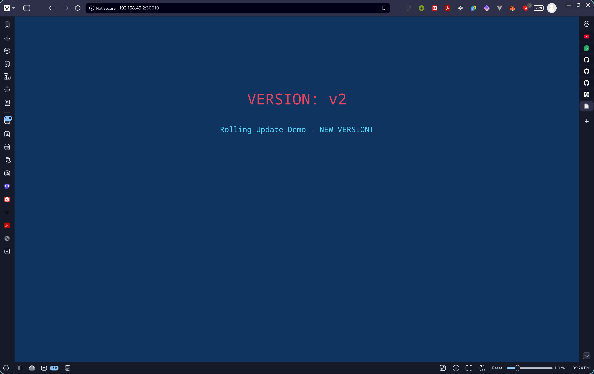

Blue/Green Deployment - Blue/Green deployment is a technique that reduces downtime and risk by running two identical production environments called Blue and Green. Only one of the environments is live at any given time, with the live environment serving all production traffic. The other environment is idle. In Kubernetes, we can perform a blue/green deployment using the `kubectl apply` command.
![] (bluegreen/p1.png)
![] (bluegreen/p2.png)

Canary Deployment - Canary deployment is a technique that reduces the risk of introducing a new version of software into production by slowly rolling out the change to a small subset of users before making it available to the entire infrastructure. In Kubernetes, we can perform a canary deployment using the `kubectl apply` command.
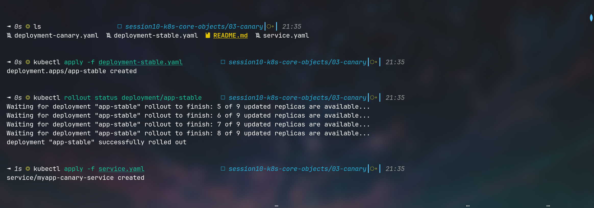
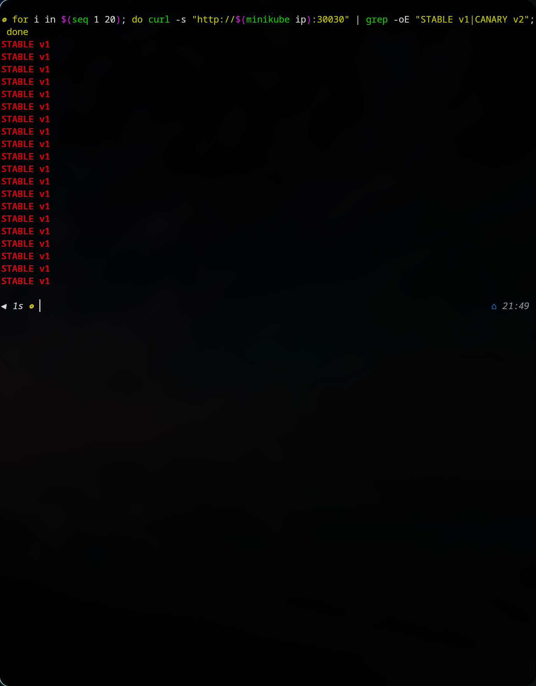

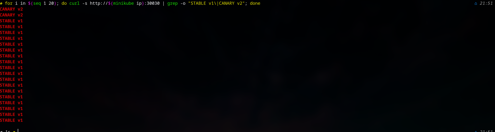
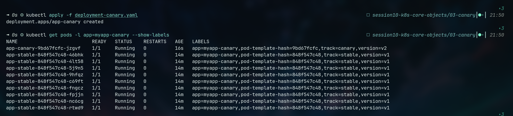
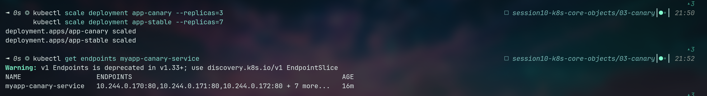
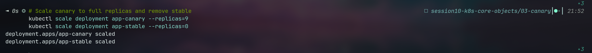
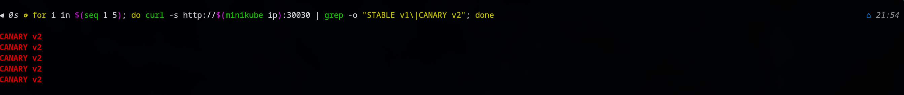

Recreate Deployment - Recreate deployment is a technique that involves stopping the old version of the application and starting the new version. This approach can lead to downtime, but it is simple to implement. In Kubernetes, we can perform a recreate deployment using the `kubectl delete` and `kubectl apply` commands.
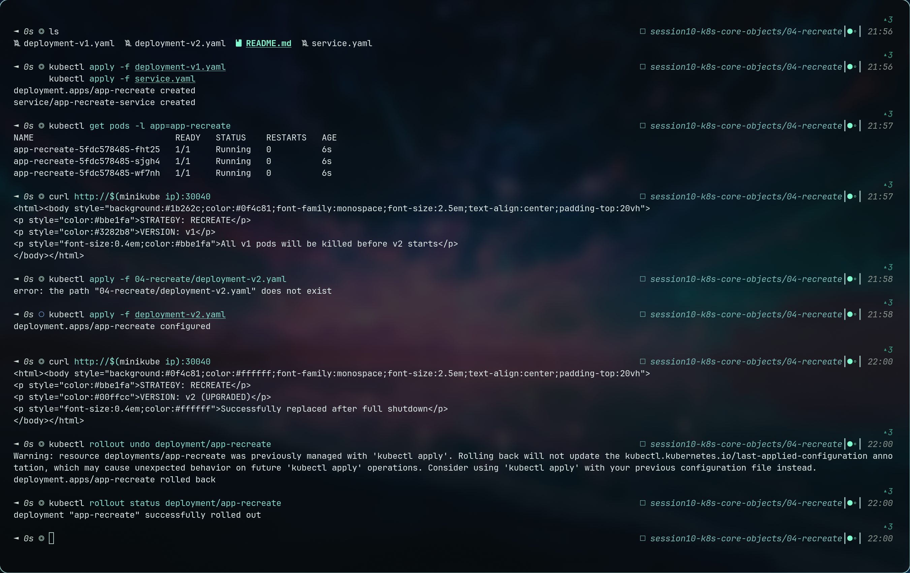

