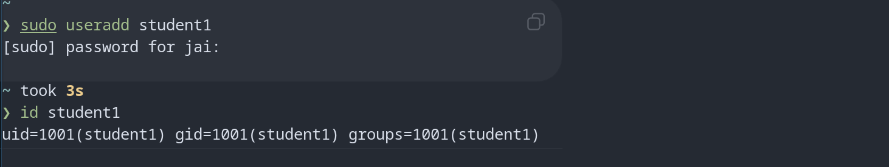

What is a Link?

A link is another way to access a file.

Linux provides two types:
Soft Link (Symbolic Link)
Hard Link

Soft Link (Symbolic Link)

A soft link points to the original file's path.

Hard Link

A hard link points directly to the file's inode.

Multiple filenames can point to the same data.

useradd

Low-level utility.

Requires more manual configuration.

Example:

sudo useradd testuser

Problems:

No password set
Home directory may not be created
Less user-friendly

adduser

Higher-level interactive tool.

Automatically:

Creates home directory
Creates group
Prompts for password
Sets user information

Task3 - 

journalctl is used to view logs collected by systemd-journald.

It replaces many traditional log-viewing methods.

Logs include:

Kernel logs
System logs
Service logs
Boot logs

    