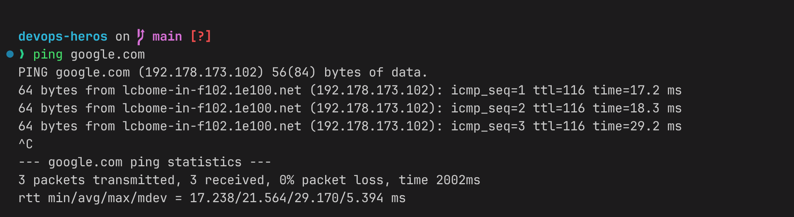
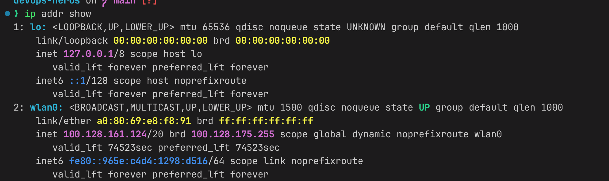

Ping - ping is a network utility that sends ICMP echo requests to a host and measures whether it is reachable, along with the round-trip response time.

ip - show ip address and network interfaces

dig - shows DNS information for a domain name

curl - curl is a command-line tool for transferring data to or from a server, supporting various protocols such as HTTP, HTTPS, FTP, and more. It is commonly used to make requests to web servers and retrieve data.
