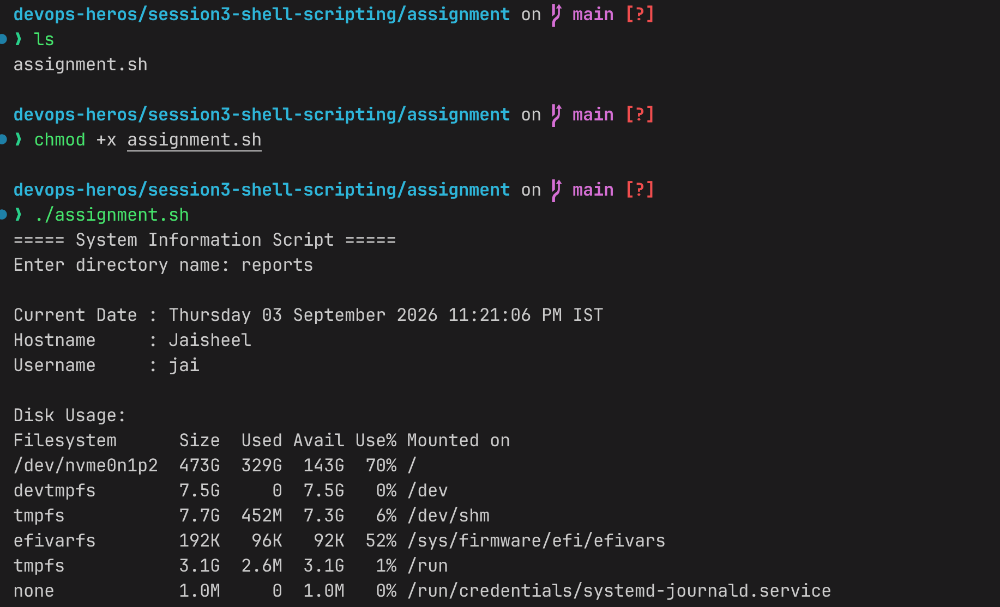

 
 
 
 ./assignment.sh  
===== System Information Script =====
Enter directory name: reports

Current Date : Thursday 03 September 2026 11:21:06 PM IST
Hostname     : Jaisheel
Username     : jai

Disk Usage:
Filesystem      Size  Used Avail Use% Mounted on
/dev/nvme0n1p2  473G  329G  143G  70% /
devtmpfs        7.5G     0  7.5G   0% /dev
tmpfs           7.7G  452M  7.3G   6% /dev/shm
efivarfs        192K   96K   92K  52% /sys/firmware/efi/efivars
tmpfs           3.1G  2.6M  3.1G   1% /run
none            1.0M     0  1.0M   0% /run/credentials/systemd-journald.service
none            1.0M     0  1.0M   0% /run/credentials/systemd-resolved.service
/dev/nvme0n1p2  473G  329G  143G  70% /root
/dev/nvme0n1p2  473G  329G  143G  70% /srv
/dev/nvme0n1p2  473G  329G  143G  70% /home
tmpfs           7.7G   76M  7.6G   1% /tmp
/dev/nvme0n1p2  473G  329G  143G  70% /var/log
/dev/nvme0n1p2  473G  329G  143G  70% /var/cache
/dev/nvme0n1p2  473G  329G  143G  70% /var/tmp
/dev/nvme0n1p1  4.0G 1009M  3.1G  25% /boot
tmpfs           1.6G  184K  1.6G   1% /run/user/1000

Creating directory: reports
Creating file: reports/processes.txt

Running Processes:
USER         PID %CPU %MEM    VSZ   RSS TTY      STAT START   TIME COMMAND
root           1  0.0  0.0  21864 12312 ?        Ss   17:43   0:03 /usr/lib/systemd/systemd --switched-root --s
root           2  0.0  0.0      0     0 ?        S    17:43   0:00 [kthreadd]
root           3  0.0  0.0      0     0 ?        S    17:43   0:00 [pool_workqueue_release]
root           4  0.0  0.0      0     0 ?        I<   17:43   0:00 [kworker/R-rcu_gp]
root           5  0.0  0.0      0     0 ?        I<   17:43   0:00 [kworker/R-sync_wq]
root           6  0.0  0.0      0     0 ?        I<   17:43   0:00 [kworker/R-kvfree_rcu_reclaim]
root           7  0.0  0.0      0     0 ?        I<   17:43   0:00 [kworker/R-slub_flushwq]
root           8  0.0  0.0      0     0 ?        I<   17:43   0:00 [kworker/R-netns]
root          10  0.0  0.0      0     0 ?        I<   17:43   0:00 [kworker/0:0H-kblockd]
root          13  0.0  0.0      0     0 ?        I<   17:43   0:00 [kworker/R-mm_percpu_wq]
root          15  0.0  0.0      0     0 ?        S    17:43   0:01 [ksoftirqd/0]
root          16  0.0  0.0      0     0 ?        I    17:43   0:18 [rcu_preempt]
root          17  0.0  0.0      0     0 ?        S    17:43   0:00 [rcub/0]
root          18  0.0  0.0      0     0 ?        S    17:43   0:00 [rcu_exp_par_gp_kthread_worker/0]
root          19  0.0  0.0      0     0 ?        S    17:43   0:00 [rcu_exp_gp_kthread_worker]
root          20  0.0  0.0      0     0 ?        S    17:43   0:01 [migration/0]
root          21  0.0  0.0      0     0 ?        S    17:43   0:00 [kprobe-optimizer]
root          22  0.0  0.0      0     0 ?        S    17:43   0:00 [idle_inject/0]
root          23  0.0  0.0      0     0 ?        S    17:43   0:00 [cpuhp/0]
root          24  0.0  0.0      0     0 ?        S    17:43   0:00 [cpuhp/2]
root          25  0.0  0.0      0     0 ?        S    17:43   0:00 [idle_inject/2]
root          26  0.0  0.0      0     0 ?        S    17:43   0:01 [migration/2]
root          27  0.0  0.0      0     0 ?        S    17:43   0:00 [ksoftirqd/2]
root          29  0.0  0.0      0     0 ?        I<   17:43   0:00 [kworker/2:0H-i915_cleanup]
root          30  0.0  0.0      0     0 ?        S    17:43   0:00 [cpuhp/4]
root          31  0.0  0.0      0     0 ?        S    17:43   0:00 [idle_inject/4]
root          32  0.0  0.0      0     0 ?        S    17:43   0:01 [migration/4]
root          33  0.0  0.0      0     0 ?        S    17:43   0:00 [ksoftirqd/4]
root          35  0.0  0.0      0     0 ?        I<   17:43   0:00 [kworker/4:0H-kblockd]
root          36  0.0  0.0      0     0 ?        S    17:43   0:00 [cpuhp/6]
root          37  0.0  0.0      0     0 ?        S    17:43   0:00 [idle_inject/6]
root          38  0.0  0.0      0     0 ?        S    17:43   0:00 [migration/6]
root          39  0.0  0.0      0     0 ?        S    17:43   0:00 [ksoftirqd/6]
root          41  0.0  0.0      0     0 ?        I<   17:43   0:00 [kworker/6:0H-kblockd]
root          42  0.0  0.0      0     0 ?        S    17:43   0:00 [cpuhp/8]
root          43  0.0  0.0      0     0 ?        S    17:43   0:00 [idle_inject/8]
root          44  0.0  0.0      0     0 ?        S    17:43   0:05 [migration/8]
root          45  0.0  0.0      0     0 ?        S    17:43   0:00 [ksoftirqd/8]
root          47  0.0  0.0      0     0 ?        I<   17:43   0:00 [kworker/8:0H-kblockd]
root          48  0.0  0.0      0     0 ?        S    17:43   0:00 [cpuhp/9]
root          49  0.0  0.0      0     0 ?        S    17:43   0:00 [idle_inject/9]
root          50  0.0  0.0      0     0 ?        S    17:43   0:02 [migration/9]
root          51  0.0  0.0      0     0 ?        S    17:43   0:00 [ksoftirqd/9]
root          53  0.0  0.0      0     0 ?        I<   17:43   0:00 [kworker/9:0H-kblockd]
root          54  0.0  0.0      0     0 ?        S    17:43   0:00 [cpuhp/10]
root          55  0.0  0.0      0     0 ?        S    17:43   0:00 [idle_inject/10]
root          56  0.0  0.0      0     0 ?        S    17:43   0:01 [migration/10]
root          57  0.0  0.0      0     0 ?        S    17:43   0:00 [ksoftirqd/10]
root          59  0.0  0.0      0     0 ?        I<   17:43   0:00 [kworker/10:0H-kblockd]
root          60  0.0  0.0      0     0 ?        S    17:43   0:00 [cpuhp/11]
root          61  0.0  0.0      0     0 ?        S    17:43   0:00 [idle_inject/11]
root          62  0.0  0.0      0     0 ?        S    17:43   0:01 [migration/11]
root          63  0.0  0.0      0     0 ?        S    17:43   0:00 [ksoftirqd/11]
root          65  0.0  0.0      0     0 ?        I<   17:43   0:00 [kworker/11:0H-kblockd]
root          66  0.0  0.0      0     0 ?        S    17:43   0:00 [cpuhp/12]
root          67  0.0  0.0      0     0 ?        S    17:43   0:00 [idle_inject/12]
root          68  0.0  0.0      0     0 ?        S    17:43   0:02 [migration/12]
root          69  0.0  0.0      0     0 ?        S    17:43   0:00 [ksoftirqd/12]
root          71  0.0  0.0      0     0 ?        I<   17:43   0:00 [kworker/12:0H-kblockd]
root          72  0.0  0.0      0     0 ?        S    17:43   0:00 [cpuhp/13]
root          73  0.0  0.0      0     0 ?        S    17:43   0:00 [idle_inject/13]
root          74  0.0  0.0      0     0 ?        S    17:43   0:01 [migration/13]
root          75  0.0  0.0      0     0 ?        S    17:43   0:00 [ksoftirqd/13]
root          77  0.0  0.0      0     0 ?        I<   17:43   0:00 [kworker/13:0H-kblockd]
root          78  0.0  0.0      0     0 ?        S    17:43   0:00 [cpuhp/14]
root          79  0.0  0.0      0     0 ?        S    17:43   0:00 [idle_inject/14]
root          80  0.0  0.0      0     0 ?        S    17:43   0:00 [migration/14]
root          81  0.0  0.0      0     0 ?        S    17:43   0:00 [ksoftirqd/14]
root          83  0.0  0.0      0     0 ?        I<   17:43   0:00 [kworker/14:0H-kblockd]
root          84  0.0  0.0      0     0 ?        S    17:43   0:00 [cpuhp/15]
root          85  0.0  0.0      0     0 ?        S    17:43   0:00 [idle_inject/15]
root          86  0.0  0.0      0     0 ?        S    17:43   0:00 [migration/15]
root          87  0.0  0.0      0     0 ?        S    17:43   0:00 [ksoftirqd/15]
root          89  0.0  0.0      0     0 ?        I<   17:43   0:00 [kworker/15:0H-kblockd]
root          90  0.0  0.0      0     0 ?        S    17:43   0:00 [cpuhp/1]
root          91  0.0  0.0      0     0 ?        S    17:43   0:00 [idle_inject/1]
root          92  0.0  0.0      0     0 ?        S    17:43   0:00 [migration/1]
root          93  0.0  0.0      0     0 ?        S    17:43   0:00 [ksoftirqd/1]
root          95  0.0  0.0      0     0 ?        I<   17:43   0:00 [kworker/1:0H-kblockd]
root          96  0.0  0.0      0     0 ?        S    17:43   0:00 [cpuhp/3]
root          97  0.0  0.0      0     0 ?        S    17:43   0:00 [idle_inject/3]
root          98  0.0  0.0      0     0 ?        S    17:43   0:00 [migration/3]
root          99  0.0  0.0      0     0 ?        S    17:43   0:00 [ksoftirqd/3]
root         101  0.0  0.0      0     0 ?        I<   17:43   0:00 [kworker/3:0H-kblockd]
root         102  0.0  0.0      0     0 ?        S    17:43   0:00 [cpuhp/5]
root         103  0.0  0.0      0     0 ?        S    17:43   0:00 [idle_inject/5]
root         104  0.0  0.0      0     0 ?        S    17:43   0:00 [migration/5]
root         105  0.0  0.0      0     0 ?        S    17:43   0:00 [ksoftirqd/5]
root         107  0.0  0.0      0     0 ?        I<   17:43   0:00 [kworker/5:0H-i915_cleanup]
root         108  0.0  0.0      0     0 ?        S    17:43   0:00 [cpuhp/7]
root         109  0.0  0.0      0     0 ?        S    17:43   0:00 [idle_inject/7]
root         110  0.0  0.0      0     0 ?        S    17:43   0:00 [migration/7]
root         111  0.0  0.0      0     0 ?        S    17:43   0:00 [ksoftirqd/7]
root         113  0.0  0.0      0     0 ?        I<   17:43   0:00 [kworker/7:0H-kblockd]
root         116  0.0  0.0      0     0 ?        S    17:43   0:00 [kdevtmpfs]
root         117  0.0  0.0      0     0 ?        I<   17:43   0:00 [kworker/R-inet_frag_wq]
root         118  0.0  0.0      0     0 ?        I    17:43   0:00 [rcu_tasks_kthread]
root         119  0.0  0.0      0     0 ?        I    17:43   0:00 [rcu_tasks_rude_kthread]
root         120  0.0  0.0      0     0 ?        S    17:43   0:00 [kauditd]
root         121  0.0  0.0      0     0 ?        S    17:43   0:00 [khungtaskd]
root         122  0.0  0.0      0     0 ?        S    17:43   0:00 [oom_reaper]
root         125  0.0  0.0      0     0 ?        I<   17:43   0:00 [kworker/R-writeback]
root         126  0.0  0.0      0     0 ?        S    17:43   0:01 [kcompactd0]
root         127  0.0  0.0      0     0 ?        SN   17:43   0:00 [ksmd]
root         128  0.0  0.0      0     0 ?        SN   17:43   0:01 [khugepaged]
root         129  0.0  0.0      0     0 ?        I<   17:43   0:00 [kworker/R-kblockd]
root         130  0.0  0.0      0     0 ?        I<   17:43   0:00 [kworker/R-blkcg_punt_bio]
root         131  0.0  0.0      0     0 ?        I<   17:43   0:00 [kworker/R-kintegrityd]
root         132  0.0  0.0      0     0 ?        S    17:43   0:00 [irq/9-acpi]
root         138  0.0  0.0      0     0 ?        I<   17:43   0:00 [kworker/R-tpm_dev_wq]
root         139  0.0  0.0      0     0 ?        I<   17:43   0:00 [kworker/R-ata_sff]
root         140  0.0  0.0      0     0 ?        I<   17:43   0:00 [kworker/R-edac-poller]
root         142  0.0  0.0      0     0 ?        I<   17:43   0:00 [kworker/R-devfreq_wq]
root         143  0.0  0.0      0     0 ?        S    17:43   0:00 [watchdogd]
root         145  0.0  0.0      0     0 ?        I<   17:43   0:00 [kworker/R-quota_events_unbound]
root         148  0.4  0.0      0     0 ?        S    17:43   1:25 [kswapd0]
root         149  0.0  0.0      0     0 ?        I<   17:43   0:00 [kworker/R-kthrotld]
root         150  0.0  0.0      0     0 ?        S    17:43   0:00 [irq/120-aerdrv]
root         151  0.0  0.0      0     0 ?        I<   17:43   0:00 [kworker/R-acpi_thermal_pm]
root         153  0.0  0.0      0     0 ?        S    17:43   0:00 [hwrng]
root         156  0.0  0.0      0     0 ?        I<   17:43   0:00 [kworker/R-hfi-updates]
root         157  0.0  0.0      0     0 ?        I<   17:43   0:00 [kworker/R-mld]
root         158  0.0  0.0      0     0 ?        I<   17:43   0:00 [kworker/R-ipv6_addrconf]
root         159  0.0  0.0      0     0 ?        I<   17:43   0:00 [kworker/R-kstrp]
root         169  0.0  0.0      0     0 ?        I<   17:43   0:00 [kworker/R-zswap-shrink]
root         254  0.0  0.0      0     0 ?        S    17:43   0:00 [nv_queue]
root         255  0.0  0.0      0     0 ?        S    17:43   0:00 [nv_mem_pool_scrubber_queue]
root         256  0.0  0.0      0     0 ?        S    17:43   0:00 [nv_mem_pool_scrubber_queue]
root         257  0.0  0.0      0     0 ?        S    17:43   0:00 [nv_mem_pool_scrubber_queue]
root         258  0.0  0.0      0     0 ?        S    17:43   0:00 [nv_queue]
root         259  0.0  0.0      0     0 ?        S    17:43   0:00 [nv_open_q]
root         268  0.0  0.0      0     0 ?        S    17:43   0:00 [nvidia-modeset/kthread_q]
root         269  0.0  0.0      0     0 ?        S    17:43   0:00 [nvidia-modeset/deferred_close_kthread_q]
root         271  0.0  0.0      0     0 ?        S    17:43   0:00 [UVM global queue]
root         272  0.0  0.0      0     0 ?        S    17:43   0:00 [UVM deferred release queue]
root         273  0.0  0.0      0     0 ?        S    17:43   0:00 [UVM Tools Event Queue]
root         274  0.0  0.0      0     0 ?        S    17:43   0:00 [irq/148-aerdrv]
root         275  0.0  0.0      0     0 ?        S    17:43   0:00 [irq/149-nvidia]
root         277  0.0  0.0      0     0 ?        S    17:43   0:00 [nv_queue]
root         278  0.0  0.0      0     0 ?        I<   17:43   0:00 [kworker/R-ttm]
root         279  0.0  0.0      0     0 ?        I<   17:43   0:00 [kworker/R-nvme-wq]
root         280  0.0  0.0      0     0 ?        I<   17:43   0:00 [kworker/R-nvme-reset-wq]
root         281  0.0  0.0      0     0 ?        I<   17:43   0:00 [kworker/R-nvme-delete-wq]
root         282  0.0  0.0      0     0 ?        I<   17:43   0:00 [kworker/R-nvme-auth-wq]
root         283  0.0  0.0      0     0 ?        S    17:43   0:00 [card2-crtc0]
root         284  0.0  0.0      0     0 ?        S    17:43   0:00 [card2-crtc1]
root         285  0.0  0.0      0     0 ?        S    17:43   0:00 [card2-crtc2]
root         286  0.0  0.0      0     0 ?        S    17:43   0:00 [card2-crtc3]
root         287  0.0  0.0      0     0 ?        I<   17:43   0:01 [kworker/0:1H-kblockd]
root         289  0.0  0.0      0     0 ?        I<   17:43   0:00 [kworker/5:1H-kblockd]
root         293  0.0  0.0      0     0 ?        I<   17:43   0:00 [kworker/R-btrfs-worker]
root         294  0.0  0.0      0     0 ?        I<   17:43   0:00 [kworker/R-btrfs-delalloc]
root         295  0.0  0.0      0     0 ?        I<   17:43   0:00 [kworker/R-btrfs-flush_delalloc]
root         296  0.0  0.0      0     0 ?        I<   17:43   0:00 [kworker/R-btrfs-cache]
root         297  0.0  0.0      0     0 ?        I<   17:43   0:00 [kworker/R-btrfs-fixup]
root         298  0.0  0.0      0     0 ?        I<   17:43   0:00 [kworker/R-btrfs-endio]
root         299  0.0  0.0      0     0 ?        I<   17:43   0:00 [kworker/R-btrfs-endio-meta]
root         300  0.0  0.0      0     0 ?        I<   17:43   0:00 [kworker/R-btrfs-rmw]
root         301  0.0  0.0      0     0 ?        I<   17:43   0:00 [kworker/R-btrfs-endio-write]
root         302  0.0  0.0      0     0 ?        I<   17:43   0:00 [kworker/R-btrfs-freespace-write]
root         303  0.0  0.0      0     0 ?        I<   17:43   0:00 [kworker/R-btrfs-delayed-meta]
root         304  0.0  0.0      0     0 ?        I<   17:43   0:00 [kworker/R-btrfs-qgroup-rescan]
root         305  0.0  0.0      0     0 ?        S    17:43   0:00 [btrfs-cleaner]
root         306  0.0  0.0      0     0 ?        S    17:43   0:10 [btrfs-transaction]
root         320  0.0  0.0      0     0 ?        I<   17:43   0:01 [kworker/2:1H-kblockd]
root         336  0.0  0.0      0     0 ?        I<   17:43   0:01 [kworker/8:1H-kblockd]
root         343  0.0  0.0      0     0 ?        I<   17:43   0:00 [kworker/12:1H-kblockd]
root         344  0.0  0.0      0     0 ?        I<   17:43   0:01 [kworker/10:1H-i915_cleanup]
root         347  0.0  0.0      0     0 ?        I<   17:43   0:01 [kworker/6:1H-i915_cleanup]
root         355  0.0  0.0      0     0 ?        I<   17:43   0:00 [kworker/9:1H-kblockd]
root         362  0.0  0.0      0     0 ?        I<   17:43   0:00 [kworker/3:1H-kblockd]
root         364  0.0  0.0      0     0 ?        I<   17:43   0:01 [kworker/14:1H-i915_cleanup]
root         367  0.0  0.0      0     0 ?        I<   17:43   0:01 [kworker/15:1H-kblockd]
root         369  0.0  0.0      0     0 ?        I<   17:43   0:01 [kworker/13:1H-i915_cleanup]
root         373  0.0  0.0      0     0 ?        I<   17:43   0:01 [kworker/4:1H-i915_cleanup]
root         382  0.0  0.0      0     0 ?        I<   17:43   0:01 [kworker/11:1H-i915_cleanup]
root         389  0.0  0.0      0     0 ?        S    17:43   0:00 [psimon]
root         399  0.0  0.0 120860 10000 ?        Ss   17:43   0:01 /usr/lib/systemd/systemd-journald
root         402  0.0  0.0      0     0 ?        I<   17:43   0:00 [kworker/7:1H-kblockd]
root         403  0.0  0.0      0     0 ?        I<   17:43   0:00 [kworker/1:1H-kblockd]
root         425  0.0  0.0   9412  4084 ?        Ss   17:43   0:00 /usr/lib/systemd/systemd-userdbd
root         504  0.0  0.0      0     0 ?        S    17:43   0:00 [psimon]
systemd+     509  1.2  0.1  36928 20192 ?        Ss   17:43   4:21 /usr/lib/systemd/systemd-resolved
systemd+     510  0.0  0.0  85308  5712 ?        Ssl  17:43   0:00 /usr/lib/systemd/systemd-timesyncd
root         516  0.0  0.0  46076 10796 ?        Ss   17:43   0:02 /usr/lib/systemd/systemd-udevd
root         518  0.0  0.0      0     0 ?        S    17:43   0:00 [psimon]
root         589  0.2  0.0      0     0 ?        S    17:43   0:59 [irq/170-ASUE1307:00]
root         592  0.0  0.0      0     0 ?        S    17:43   0:00 [irq/169-ITE5570:00]
root         601  0.0  0.0      0     0 ?        I<   17:43   0:00 [kworker/R-cfg80211]
root         614  0.0  0.0      0     0 ?        S    17:43   0:03 [irq/171-iwlwifi:default_queue]
root         616  0.0  0.0      0     0 ?        S    17:43   0:02 [irq/172-iwlwifi:queue_1]
root         617  0.0  0.0      0     0 ?        S    17:43   0:02 [irq/173-iwlwifi:queue_2]
root         618  0.0  0.0      0     0 ?        S    17:43   0:02 [irq/174-iwlwifi:queue_3]
root         619  0.0  0.0      0     0 ?        S    17:43   0:02 [irq/175-iwlwifi:queue_4]
root         620  0.0  0.0      0     0 ?        S    17:43   0:02 [irq/176-iwlwifi:queue_5]
root         621  0.0  0.0      0     0 ?        S    17:43   0:02 [irq/177-iwlwifi:queue_6]
root         622  0.0  0.0      0     0 ?        S    17:43   0:02 [irq/178-iwlwifi:queue_7]
root         623  0.0  0.0      0     0 ?        S    17:43   0:02 [irq/179-iwlwifi:queue_8]
root         624  0.0  0.0      0     0 ?        S    17:43   0:03 [irq/180-iwlwifi:queue_9]
root         625  0.0  0.0      0     0 ?        S    17:43   0:02 [irq/181-iwlwifi:queue_10]
root         626  0.0  0.0      0     0 ?        S    17:43   0:02 [irq/182-iwlwifi:queue_11]
root         627  0.0  0.0      0     0 ?        S    17:43   0:02 [irq/183-iwlwifi:queue_12]
root         628  0.0  0.0      0     0 ?        S    17:43   0:02 [irq/184-iwlwifi:queue_13]
root         629  0.0  0.0      0     0 ?        S    17:43   0:02 [irq/185-iwlwifi:queue_14]
root         630  0.0  0.0      0     0 ?        S    17:43   0:00 [irq/186-iwlwifi:exception]
root         652  0.0  0.0      0     0 ?        I<   17:43   0:00 [kworker/R-USBC000:00-con1]
root         653  0.0  0.0      0     0 ?        S    17:43   0:00 [irq/16-processor_thermal_device_pci]
root         656  0.0  0.0      0     0 ?        I<   17:43   0:00 [kworker/R-led_workqueue]
root         690  0.0  0.0      0     0 ?        S    17:43   0:00 [irq/187-AudioDSP]
dbus         802  0.0  0.0   8576  3508 ?        SNs  17:43   0:00 /usr/bin/dbus-broker-launch --scope system -
dbus         803  0.1  0.0   7948  4504 ?        SN   17:43   0:21 dbus-broker --log 10 --controller 9 --machin
root         804  0.0  0.0 182000 12872 ?        S<sl 17:43   0:12 /usr/bin/ananicy-cpp start
root         805  0.0  0.0 427832 15740 ?        SNsl 17:43   0:03 /usr/bin/NetworkManager --no-daemon
avahi        807  6.6  0.0  13484 10868 ?        Ss   17:43  22:29 avahi-daemon: running [Jaisheel.local]
root         808  0.0  0.0  12520  5808 ?        SNs  17:43   0:08 /usr/lib/bluetooth/bluetoothd
root         810  0.0  0.0   5608  2972 ?        Ss   17:43   0:00 /usr/bin/dmemcg-booster --use-system-bus
root         815  2.0  0.0 241312  5608 ?        Ssl  17:43   6:59 /usr/bin/nvidia-powerd
root         820  0.0  0.0  10940  6340 ?        Ss   17:43   0:00 /usr/lib/systemd/systemd-logind
avahi        842  0.0  0.0   6592  1120 ?        S    17:43   0:00 avahi-daemon: chroot helper
root         904  0.0  0.0  23960  7860 ?        Ss   17:43   0:00 /usr/bin/wpa_supplicant -u -s -O /run/wpa_su
jai          914  0.0  0.0  20028 10252 ?        Ss   17:43   0:02 /usr/lib/systemd/systemd --user
root         918  0.1  0.3 2530864 55756 ?       Ssl  17:43   0:38 /usr/bin/containerd
jai          920  0.0  0.0  19856  1908 ?        S    17:43   0:00 (sd-pam)
root         934  0.0  0.0 167880 10524 ?        SNsl 17:43   0:00 /usr/bin/plasmalogin
jai          991  0.2  0.7 960448 121648 ?       Ssl  17:43   0:45 /home/jai/.hermes/hermes-agent/venv/bin/pyth
rtkit       1056  0.0  0.0  21424  3028 ?        SNsl 17:43   0:00 /usr/lib/rtkit-daemon
polkitd     1063  0.0  0.0 386100 11528 ?        Ssl  17:43   0:03 /usr/lib/polkit-1/polkitd --no-debug --log-l
root        1090  0.0  0.0      0     0 ?        S<   17:43   0:00 [krfcommd]
root        1127  0.0  0.0 324580 12840 ?        SNsl 17:43   0:11 /usr/lib/upowerd
root        1158  0.0  0.3 2645280 48884 ?       Ssl  17:43   0:08 /usr/bin/dockerd -H fd:// --containerd=/run/
root        1570  0.0  0.0 100884  8652 ?        SN   17:43   0:00 /usr/lib/plasmalogin-helper --socket /tmp/pl
jai         1575  0.0  0.0 184428  6804 ?        SNLsl 17:43   0:00 /usr/bin/gnome-keyring-daemon --foreground 
jai         1580  0.0  0.0   7948  3512 ?        SNs  17:43   0:00 /usr/bin/dbus-broker-launch --scope user
jai         1581  0.0  0.0   8568  4900 ?        SN   17:43   0:09 dbus-broker --log 11 --controller 10 --machi
jai         1585  0.0  0.1 423556 24756 ?        SNLl 17:43   0:00 /usr/bin/ksecretd --pam-login 8 9
jai         1586  0.0  0.0 240640 10848 tty2     S<sl+ 17:43   0:00 /usr/bin/startplasma-wayland
jai         1647  0.0  0.0   5608  3084 ?        Ss   17:43   0:00 /usr/bin/dmemcg-booster
jai         1651  0.0  0.0 157672  7404 ?        S<sl 17:43   0:00 /usr/bin/kwin_wayland_wrapper --xwayland
jai         1656  0.0  0.1 1152956 31476 ?       Ssl  17:43   0:09 /usr/bin/foreground_booster
jai         1658  4.9  1.5 2138372 255348 ?      S<l  17:43  16:51 /usr/bin/kwin_wayland --wayland-fd 7 --socke
jai         1696  0.1  0.1  44512 16392 ?        S<sl 17:43   0:35 /usr/bin/pipewire
jai         1698  2.0  0.1 500748 22632 ?        S<sl 17:43   6:52 /usr/bin/wireplumber
jai         1725  0.8  0.3 617632 60884 ?        S<l  17:43   2:51 /usr/bin/Xwayland :0 -auth /run/user/1000/xa
jai         1743  0.0  0.0 381144  7212 ?        SNsl 17:43   0:00 /usr/lib/at-spi-bus-launcher
jai         1756  0.0  0.0   7948  3004 ?        SN   17:43   0:00 /usr/bin/dbus-broker-launch --config-file=/u
jai         1760  0.0  0.0   5020  2680 ?        SN   17:43   0:00 dbus-broker --log 10 --controller 9 --machin
jai         1774  0.0  0.1 332084 19944 ?        SNsl 17:43   0:00 /usr/bin/ksmserver
jai         1776  0.0  0.2 1463716 46092 ?       SNsl 17:43   0:12 /usr/bin/kded6
jai         1788  1.4  2.3 2834572 371756 ?      S<sl 17:43   4:53 /usr/bin/plasmashell --no-respawn
jai         1792  0.0  0.0 169072  6836 ?        SNsl 17:43   0:00 /usr/lib/at-spi2-registryd --use-gnome-sessi
jai         1795  0.0  0.0 166524  6448 ?        SNsl 17:43   0:00 /usr/lib/dconf-service
root        1809  0.0  0.0 482372  9520 ?        SNsl 17:43   0:03 /usr/lib/udisks2/udisksd
jai         1818  0.0  0.1 673648 25832 ?        Ssl  17:43   0:00 /usr/lib/kactivitymanagerd
jai         1820  0.0  0.1 234944 16060 ?        Ssl  17:43   0:00 /usr/bin/gmenudbusmenuproxy
jai         1821  0.0  0.1 329960 22016 ?        SNsl 17:43   0:00 /usr/bin/kaccess
jai         1822  0.0  0.1 557948 18336 ?        SNsl 17:43   0:00 /usr/lib/polkit-kde-authentication-agent-1
jai         1823  0.0  0.1 781868 30140 ?        SNsl 17:43   0:03 /usr/lib/org_kde_powerdevil
jai         1826  0.0  0.0 234324 15664 ?        Ssl  17:43   0:00 /usr/bin/xembedsniproxy
jai         1853  0.9  0.0 124796 15480 ?        S<sl 17:43   3:12 /usr/bin/pipewire-pulse
jai         1909  0.0  0.0   9540  3300 ?        SN   17:43   0:00 /usr/bin/xsettingsd
jai         1912  0.0  0.0  51484  4584 ?        SNs  17:43   0:00 /usr/lib/bluetooth/obexd
jai         1950  0.0  0.3 949000 49876 ?        SNsl 17:43   0:11 /usr/bin/kdeconnectd
root        2021  0.0  0.0 309648  9184 ?        SNsl 17:43   0:00 /usr/lib/power-profiles-daemon
jai         2023  0.1  0.2 725800 37864 ?        Ssl  17:43   0:39 /usr/bin/python /usr/bin/blueman-applet
jai         2039  0.0  0.0   8580  5568 ?        S<s  17:43   0:00 bash /usr/bin/limine-snapper-notify
jai         2062  0.0  0.0 627688 13452 ?        SNsl 17:43   0:03 /usr/lib/xdg-desktop-portal
jai         2070  0.0  0.0 149276  4496 ?        Ssl  17:43   0:00 /usr/lib/arch-update/arch-update-tray
jai         2071  0.0  0.1  89292 26448 ?        S    17:43   0:00 journalctl --output=short-iso -b -p 3 -n0 -f
jai         2093  0.0  0.0 308644  8048 ?        SNsl 17:43   0:00 /usr/lib/xdg-permission-store
jai         2157  0.0  0.0 687552  9724 ?        SNsl 17:43   0:00 /usr/lib/xdg-document-portal
root        2168  0.0  0.0   3268  2248 ?        Ss   17:43   0:00 fusermount3 -o rw,nosuid,nodev,fsname=portal
jai         2172  0.0  0.0 533436 14856 ?        SNsl 17:43   0:00 /usr/lib/xdg-desktop-portal-gtk
jai         2204  0.0  0.1 1159096 25684 ?       SNsl 17:43   0:02 /usr/lib/xdg-desktop-portal-kde
jai         2269  0.1  0.2 572480 34168 ?        Sl   17:43   0:39 /usr/bin/python /usr/bin/blueman-tray
jai         2305  0.0  0.1 562700 22628 ?        SNLsl 17:43   0:00 /usr/bin/kwalletd6
jai         2695  0.0  0.1 403200 21544 ?        SNsl 17:43   0:00 /usr/lib/baloorunner
root        5702  0.0  0.0      0     0 ?        I    18:34   0:00 [kworker/14:2-mm_percpu_wq]
jai         5764  0.0  0.1 415636 21652 ?        S<l  18:34   0:00 /usr/lib/kf6/kioworker /usr/lib/qt6/plugins/
jai         9958  0.0  0.8 1938232 138920 ?      S<sl 18:44   0:04 /usr/bin/krunner --daemon
jai        12505  0.0  0.0   8716  5528 ?        S<s  18:49   0:00 bash /home/jai/.local/share/Steam/steam.sh -
jai        12525  0.0  0.0  23860  4904 ?        S    18:49   0:00 /home/jai/.local/share/Steam/ubuntu12_32/ste
jai        12626  1.3  0.1 951428 27988 ?        SNl  18:49   3:46 /home/jai/.local/share/Steam/ubuntu12_32/ste
jai        12651  0.0  0.0   5364  1992 ?        S<s  18:49   0:00 /home/jai/.local/share/Steam/steamrt64/pv-ru
jai        12663  0.0  0.0  22340  4332 ?        SN   18:49   0:00 /home/jai/.local/share/Steam/ubuntu12_32/ste
jai        12806  0.0  0.0 317436  4940 ?        SNl  18:49   0:00 steam-runtime-launcher-service --alongside-s
jai        12816  0.0  0.0  27088  3980 ?        S<s  18:49   0:00 /usr/lib/pressure-vessel/from-host/libexec/s
jai        12849  1.1  0.7 2461204 120444 ?      S<l  18:49   3:13 ./steamwebhelper -nocrashdialog -lang=en_US 
jai        12852  0.0  0.0 421744 15696 ?        S<l  18:49   0:00 /home/jai/.local/share/Steam/ubuntu12_64/ste
jai        12857  0.0  0.0 34114804 8348 ?       S<   18:49   0:00 /home/jai/.local/share/Steam/ubuntu12_64/ste
jai        12858  0.0  0.0 34114792 8872 ?       S<   18:49   0:00 /home/jai/.local/share/Steam/ubuntu12_64/ste
jai        12860  0.0  0.0 34114816 1776 ?       S<   18:49   0:00 /home/jai/.local/share/Steam/ubuntu12_64/ste
jai        12879  0.1  0.6 35750668 99016 ?      S<l  18:49   0:21 /home/jai/.local/share/Steam/ubuntu12_64/ste
jai        12917  0.0  0.1 1258768 28680 ?       Sl   18:49   0:01 /proc/self/exe --type=utility --utility-sub-
jai        12918  0.0  0.1 34559168 21652 ?      S<l  18:49   0:00 /home/jai/.local/share/Steam/ubuntu12_64/ste
jai        12954  0.3  0.8 56307204 130196 ?     S<l  18:49   1:02 /home/jai/.local/share/Steam/ubuntu12_64/ste
jai        14364  0.0  0.1 1031688 25276 ?       Sl   18:50   0:02 /proc/self/exe --type=utility --utility-sub-
jai        14506  0.0  0.2 49931736 35216 ?      Sl   18:51   0:02 /home/jai/.local/share/Steam/ubuntu12_64/ste
root       19182  0.0  0.0      0     0 ?        S    20:40   0:00 [irq/168-mei_me]
root       19258  0.0  0.0      0     0 ?        S    20:40   0:00 [nvidia]
jai        19391  3.6  2.4 56022660 389188 ?     S<sl 20:41   5:45 /opt/vivaldi/vivaldi-bin
jai        19398  0.0  0.0  12080  4184 ?        S    20:41   0:00 cat
jai        19399  0.0  0.0  12080  4200 ?        S    20:41   0:00 cat
jai        19401  0.0  0.0 54554392 2676 ?       SNl  20:41   0:00 /opt/vivaldi/chrome_crashpad_handler --monit
jai        19403  0.0  0.0 54546180 2488 ?       SNl  20:41   0:00 /opt/vivaldi/chrome_crashpad_handler --no-pe
jai        19411  0.0  0.1 55243504 29948 ?      S    20:41   0:00 /opt/vivaldi/vivaldi-bin --type=zygote --no-
jai        19412  0.0  0.2 55243492 34056 ?      S    20:41   0:00 /opt/vivaldi/vivaldi-bin --type=zygote --cra
jai        19414  0.0  0.0 55243524 9076 ?       S    20:41   0:00 /opt/vivaldi/vivaldi-bin --type=zygote --cra
jai        19445  5.6  1.1 55799896 190452 ?     S<l  20:41   9:03 /opt/vivaldi/vivaldi-bin --type=gpu-process 
jai        19447  0.7  0.5 55080124 95540 ?      Sl   20:41   1:12 /opt/vivaldi/vivaldi-bin --type=utility --ut
jai        19469  0.0  0.3 55310652 50556 ?      Sl   20:41   0:01 /opt/vivaldi/vivaldi-bin --type=utility --ut
jai        19480  2.2  1.7 1522855044 274088 ?   Sl   20:41   3:39 /opt/vivaldi/vivaldi-bin --type=renderer --c
jai        19497  0.0  0.8 1520828256 135584 ?   SNl  20:41   0:05 /opt/vivaldi/vivaldi-bin --type=renderer --c
jai        19502  0.1  0.8 1520822832 142308 ?   Sl   20:41   0:16 /opt/vivaldi/vivaldi-bin --type=renderer --c
jai        19504  0.0  0.8 1520828476 137888 ?   SNl  20:41   0:05 /opt/vivaldi/vivaldi-bin --type=renderer --c
jai        19515  0.8  1.7 1520833988 285856 ?   Sl   20:41   1:19 /opt/vivaldi/vivaldi-bin --type=renderer --c
jai        19522  0.3  1.4 1520826420 227752 ?   SNl  20:41   0:35 /opt/vivaldi/vivaldi-bin --type=renderer --c
jai        19572  0.0  0.7 1520829816 115616 ?   SNl  20:41   0:08 /opt/vivaldi/vivaldi-bin --type=renderer --c
jai        19627  0.0  0.4 565400 64508 ?        S<l  20:41   0:01 /usr/bin/plasma-browser-integration-host chr
jai        19679  0.0  0.7 1528751000 118088 ?   SNl  20:41   0:01 /opt/vivaldi/vivaldi-bin --type=renderer --c
jai        20108  0.3  0.9 1518854016 149904 ?   SNl  20:41   0:36 /opt/vivaldi/vivaldi-bin --type=renderer --c
jai        20130  0.2  0.3 55057108 50816 ?      Sl   20:41   0:20 /opt/vivaldi/vivaldi-bin --type=utility --ut
root       22287  0.0  0.0      0     0 ?        I    21:17   0:00 [kworker/11:2-mm_percpu_wq]
root       22399  0.0  0.0      0     0 ?        I    21:20   0:00 [kworker/13:1-mm_percpu_wq]
root       22741  0.0  0.0      0     0 ?        I    21:26   0:01 [kworker/u66:3-btrfs-endio-meta]
root       23249  0.0  0.0      0     0 ?        I    21:39   0:00 [kworker/12:1-events]
root       23313  0.0  0.0      0     0 ?        I    21:39   0:01 [kworker/u65:8-events_unbound]
jai        23801  0.7  1.7 1518913056 284100 ?   Sl   21:44   0:41 /opt/vivaldi/vivaldi-bin --type=renderer --c
jai        24138  0.1  1.2 1518861816 203796 ?   SNl  21:47   0:06 /opt/vivaldi/vivaldi-bin --type=renderer --c
jai        24147  1.3  2.4 1518905772 389460 ?   SNl  21:47   1:18 /opt/vivaldi/vivaldi-bin --type=renderer --c
jai        24171  0.0  0.9 1518848836 152536 ?   SNl  21:47   0:03 /opt/vivaldi/vivaldi-bin --type=renderer --c
jai        24323  5.6  3.6 1518903432 584080 ?   Sl   21:50   5:11 /opt/vivaldi/vivaldi-bin --type=renderer --c
root       24547  0.0  0.0      0     0 ?        I    21:54   0:00 [kworker/u66:6-btrfs-endio-write]
root       24593  0.0  0.0      0     0 ?        I    21:55   0:00 [kworker/14:1-mm_percpu_wq]
root       24691  0.0  0.0      0     0 ?        I    21:57   0:00 [kworker/15:1-mm_percpu_wq]
jai        24700  0.3  1.9 1518885512 312676 ?   SNl  21:57   0:15 /opt/vivaldi/vivaldi-bin --type=renderer --c
jai        26039  0.9  2.1 1520871664 352016 ?   SNl  22:05   0:42 /opt/vivaldi/vivaldi-bin --type=renderer --c
root       26076  0.0  0.0      0     0 ?        I    22:05   0:01 [kworker/u65:2-btrfs-endio]
jai        26350  0.0  0.0 50357164 3228 ?       SNl  22:06   0:00 /usr/share/code/chrome_crashpad_handler --mo
jai        26519  0.0  0.0 243168  8152 ?        S<l  22:06   0:00 dconf watch /system/proxy/
root       26893  0.0  0.0      0     0 ?        I    22:06   0:00 [kworker/10:2-events]
root       26897  0.0  0.0      0     0 ?        I    22:06   0:00 [kworker/u66:2-btrfs-endio]
jai        27933  1.5  1.1 1520835652 190308 ?   S<sl 22:06   1:11 /usr/share/code/code .
jai        27936  0.0  0.2 50931384 43744 ?      S<   22:06   0:00 /usr/share/code/code --type=zygote --no-zygo
jai        27937  0.0  0.2 50931372 47292 ?      S<   22:06   0:00 /usr/share/code/code --type=zygote
jai        27940  0.0  0.0 50931396 8380 ?       S<   22:06   0:00 /usr/share/code/code --type=zygote
jai        27957  0.0  0.0 50357164 3236 ?       SNl  22:06   0:00 /usr/share/code/chrome_crashpad_handler --mo
jai        27977  1.7  1.0 51368660 167856 ?     S<l  22:06   1:16 /usr/share/code/code --type=gpu-process --oz
jai        27979  0.0  0.4 50744260 74708 ?      Sl   22:06   0:02 /usr/share/code/code --type=utility --utilit
jai        28018  7.2  3.0 1524742924 480876 ?   Rl   22:06   5:24 /usr/share/code/code --type=renderer --crash
jai        28046  1.0  0.9 1520394264 147912 ?   Sl   22:06   0:46 /usr/share/code/code --type=utility --utilit
jai        28047  0.0  0.6 1520419412 104252 ?   Sl   22:06   0:02 /usr/share/code/code --type=utility --utilit
jai        28079  3.5  4.3 1524676000 699664 ?   Sl   22:06   2:37 /usr/share/code/code --type=utility --utilit
jai        28115  0.0  0.5 1520413308 93676 ?    Sl   22:06   0:00 /usr/share/code/code --type=utility --utilit
jai        28171  0.0  0.0 243168  7896 ?        S<l  22:06   0:00 dconf watch /system/proxy/
jai        28394  0.0  0.5 1518363420 81452 ?    S<l  22:06   0:01 /usr/share/code/code /usr/share/code/resourc
jai        28477  0.0  0.4 1518477112 79240 ?    S<l  22:06   0:00 /usr/share/code/code /usr/share/code/resourc
jai        28529  0.0  0.4 1518355224 77012 ?    S<l  22:06   0:00 /usr/share/code/code /home/jai/.vscode/exten
jai        28530  0.0  0.4 1518322440 74256 ?    S<l  22:06   0:00 /usr/share/code/code /home/jai/.vscode/exten
jai        28531  0.0  0.5 1518355224 80308 ?    S<l  22:06   0:00 /usr/share/code/code /home/jai/.vscode/exten
jai        28622  0.0  0.5 1518364228 86916 ?    S<l  22:06   0:00 /usr/share/code/code /home/jai/.vscode/exten
jai        28790  0.0  0.1 35611444 29796 ?      Sl   22:06   0:01 /home/jai/.vscode/extensions/vscjava.migrate
jai        29025  0.2  0.7 1520419596 112232 ?   Sl   22:06   0:09 /usr/share/code/code --type=utility --utilit
jai        30678  0.0  0.4 1518322504 74372 ?    S<l  22:07   0:01 /usr/share/code/code --max-old-space-size=30
jai        30679  0.1  0.4 1518322504 76240 ?    S<l  22:07   0:04 /usr/share/code/code --max-old-space-size=30
jai        30744  0.0  0.4 1518322440 74276 ?    S<l  22:07   0:00 /usr/share/code/code /usr/share/code/resourc
jai        32714  0.0  0.5 1518364228 81600 ?    S<l  22:09   0:00 /usr/share/code/code /home/jai/.vscode/exten
jai        32715  0.0  0.4 1518322440 73916 ?    S<l  22:09   0:00 /usr/share/code/code /home/jai/.vscode/exten
jai        32754  0.0  0.1 1258296 17480 ?       Sl   22:09   0:00 /home/jai/.vscode/extensions/docker.docker-0
jai        32774  0.0  0.0 1257272 12412 ?       Sl   22:09   0:00 /home/jai/.vscode/extensions/docker.docker-0
jai        35004  0.0  0.4 1518322440 76008 ?    S<l  22:12   0:00 /usr/share/code/code /usr/share/code/resourc
jai        36771  0.2  0.0  39800  1176 ?        Sl   22:14   0:09 /home/jai/.vscode/extensions/ms-python.vscod
jai        36856  0.0  0.0  13108  7012 pts/0    S<s+ 22:14   0:00 /usr/bin/zsh -i
jai        37694  0.1  0.7 1522275736 114224 ?   S<l  22:14   0:05 /usr/share/code/code /home/jai/.vscode/exten
jai        39054  1.1  0.9 5041152 159696 ?      Sl   22:16   0:42 /home/jai/.sdkman/candidates/java/current/bi
root       42376  0.0  0.0      0     0 ?        I    22:18   0:00 [kworker/3:1-mm_percpu_wq]
root       43542  0.0  0.0      0     0 ?        I    22:19   0:00 [kworker/5:1-events]
root       47729  0.0  0.0      0     0 ?        I    22:21   0:00 [kworker/1:2-mm_percpu_wq]
root       48134  0.0  0.0      0     0 ?        I    22:22   0:00 [kworker/10:1-events]
root       50840  0.0  0.0      0     0 ?        I    22:25   0:00 [kworker/7:2-mm_percpu_wq]
root       55292  0.0  0.0      0     0 ?        I    22:28   0:00 [kworker/u65:3-btrfs-endio]
jai        55973  0.0  0.7 1508568 119724 ?      S<sl 22:29   0:00 /usr/bin/dolphin /home/jai/Pictures/Screensh
jai        56236  0.0  0.8 1524144 131488 ?      S<sl 22:29   0:00 /usr/bin/dolphin --new-window --select /home
jai        56670  0.0  0.4 1518330636 77604 ?    S<l  22:29   0:00 /usr/share/code/code /usr/share/code/resourc
root       56714  0.0  0.0      0     0 ?        I    22:29   0:00 [kworker/u66:9-btrfs-endio]
root       61039  0.0  0.0 1268004 14904 ?       Sl   22:34   0:00 /usr/bin/containerd-shim-runc-v2 -namespace 
999        61062  0.3  2.7 2358644 440580 ?      S<sl 22:34   0:10 mysqld
root       61289  0.0  0.0      0     0 ?        I<   22:34   0:00 [kworker/R-dio/overlay]
root       61444  0.0  0.0      0     0 ?        I<   22:34   0:00 [kworker/R-dio/nvme0n1p2]
root       62066  0.0  0.0 1268260 14260 ?       Sl   22:35   0:00 /usr/bin/containerd-shim-runc-v2 -namespace 
root       62090  0.0  0.0   1748   212 pts/0    Ss+  22:35   0:00 sh
root       63252  0.0  0.0 1268260 12432 ?       Sl   22:35   0:00 /usr/bin/containerd-shim-runc-v2 -namespace 
root       63278  0.0  0.0  14960  5496 pts/0    S<s+ 22:35   0:00 nginx: master process nginx -g daemon off;
101        63381  0.0  0.0  15440  1928 pts/0    S+   22:35   0:00 nginx: worker process
101        63382  0.0  0.0  15440  1928 pts/0    S+   22:35   0:00 nginx: worker process
101        63383  0.0  0.0  15440  1928 pts/0    S+   22:35   0:00 nginx: worker process
101        63384  0.0  0.0  15440  1928 pts/0    S+   22:35   0:00 nginx: worker process
101        63385  0.0  0.0  15440  1928 pts/0    S+   22:35   0:00 nginx: worker process
101        63387  0.0  0.0  15440  1932 pts/0    S+   22:35   0:00 nginx: worker process
101        63388  0.0  0.0  15440  1932 pts/0    S+   22:35   0:00 nginx: worker process
101        63389  0.0  0.0  15440  1932 pts/0    S+   22:35   0:00 nginx: worker process
101        63391  0.0  0.0  15440  1932 pts/0    S+   22:35   0:00 nginx: worker process
101        63392  0.0  0.0  15440  1932 pts/0    S+   22:35   0:00 nginx: worker process
101        63393  0.0  0.0  15440  1932 pts/0    S+   22:35   0:00 nginx: worker process
101        63394  0.0  0.0  15440  1932 pts/0    S+   22:35   0:00 nginx: worker process
101        63396  0.0  0.0  15440  1932 pts/0    S+   22:35   0:00 nginx: worker process
101        63397  0.0  0.0  15440  1932 pts/0    S+   22:35   0:00 nginx: worker process
101        63398  0.0  0.0  15440  1932 pts/0    S+   22:35   0:00 nginx: worker process
101        63400  0.0  0.0  15440  1896 pts/0    S+   22:35   0:00 nginx: worker process
root       63620  0.0  0.0      0     0 ?        I    22:36   0:00 [kworker/9:1-events]
root       65507  0.0  0.0      0     0 ?        I    22:38   0:00 [kworker/2:1-i915-unordered]
root       72167  0.0  0.0      0     0 ?        I    22:44   0:00 [kworker/13:2-memcg]
root       72691  0.0  0.0      0     0 ?        I    22:44   0:00 [kworker/u64:0-i915]
root       73309  0.0  0.0      0     0 ?        I<   22:44   0:00 [kworker/u67:1-hci0]
jai        77724  0.0  0.6 941712 111828 ?       S<sl 22:48   0:00 /usr/bin/alacritty
jai        77734  0.0  0.0  13600 11172 pts/2    S<s+ 22:48   0:00 /usr/bin/zsh
root       78759  0.0  0.0 1268004 15032 ?       Sl   22:48   0:00 /usr/bin/containerd-shim-runc-v2 -namespace 
root       78784  0.0  0.0   6224  4828 ?        Ss   22:48   0:00 httpd -DFOREGROUND
http       78801  0.0  0.0 1997408 4296 ?        Sl   22:48   0:00 httpd -DFOREGROUND
http       78802  0.0  0.0 1997464 4792 ?        Sl   22:48   0:00 httpd -DFOREGROUND
http       78803  0.0  0.0 1997432 4576 ?        Sl   22:48   0:00 httpd -DFOREGROUND
root       79817  0.0  0.0      0     0 ?        I    22:49   0:00 [kworker/6:3-events]
http       80421  0.0  0.0 1997400 4260 ?        Sl   22:49   0:00 httpd -DFOREGROUND
root       82457  0.0  0.0      0     0 ?        I<   22:51   0:00 [kworker/u69:0-rb_allocator]
root       85004  0.0  0.0 1268004 14904 ?       Sl   22:52   0:00 /usr/bin/containerd-shim-runc-v2 -namespace 
root       85028  0.0  0.0  14960  8284 ?        S<s  22:52   0:00 nginx: master process nginx -g daemon off;
root       85078  0.0  0.0 1673408 6000 ?        Sl   22:52   0:00 /usr/bin/docker-proxy -proto tcp -host-ip 0.
root       85085  0.0  0.0 1813004 8364 ?        Sl   22:52   0:00 /usr/bin/docker-proxy -proto tcp -host-ip ::
101        85140  0.0  0.0  15440  4132 ?        S    22:52   0:00 nginx: worker process
101        85141  0.0  0.0  15440  3988 ?        S    22:52   0:00 nginx: worker process
101        85142  0.0  0.0  15440  4336 ?        S    22:52   0:00 nginx: worker process
101        85144  0.0  0.0  15440  3988 ?        S    22:52   0:00 nginx: worker process
101        85145  0.0  0.0  15440  3988 ?        S    22:52   0:00 nginx: worker process
101        85146  0.0  0.0  15440  3988 ?        S    22:52   0:00 nginx: worker process
101        85147  0.0  0.0  15440  3988 ?        S    22:52   0:00 nginx: worker process
101        85148  0.0  0.0  15440  3988 ?        S    22:52   0:00 nginx: worker process
101        85149  0.0  0.0  15440  3988 ?        S    22:52   0:00 nginx: worker process
101        85150  0.0  0.0  15440  3988 ?        S    22:52   0:00 nginx: worker process
101        85152  0.0  0.0  15440  3988 ?        S    22:52   0:00 nginx: worker process
101        85153  0.0  0.0  15440  3988 ?        S    22:52   0:00 nginx: worker process
101        85154  0.0  0.0  15440  3988 ?        S    22:52   0:00 nginx: worker process
101        85155  0.0  0.0  15440  3988 ?        S    22:52   0:00 nginx: worker process
101        85156  0.0  0.0  15440  3988 ?        S    22:52   0:00 nginx: worker process
101        85157  0.0  0.0  15440  3912 ?        S    22:52   0:00 nginx: worker process
jai        86041  0.0  1.0 1539028 166664 ?      S<sl 22:53   0:00 /usr/bin/dolphin --new-window --select /home
root       86656  0.0  0.0      0     0 ?        I    22:53   0:00 [kworker/9:0]
root       88562  0.0  0.0      0     0 ?        I    22:55   0:00 [kworker/4:0-mm_percpu_wq]
root       88596  0.0  0.0      0     0 ?        I    22:55   0:00 [kworker/8:2-events]
root       89601  0.0  0.0      0     0 ?        I    22:55   0:00 [kworker/6:1-events]
root       92789  0.0  0.0      0     0 ?        I    22:56   0:00 [kworker/12:0-events]
root       92935  0.0  0.0      0     0 ?        I    22:56   0:00 [kworker/7:1-mm_percpu_wq]
jai        94195  0.0  0.4 1518741432 73812 ?    SNl  22:58   0:00 /opt/vivaldi/vivaldi-bin --type=renderer --c
root       94409  0.0  0.0      0     0 ?        I    22:58   0:00 [kworker/0:0-events]
root       94617  0.0  0.0      0     0 ?        I    22:58   0:00 [kworker/3:0]
root       95209  0.0  0.0      0     0 ?        I    22:58   0:00 [kworker/u66:0-events_unbound]
root       95210  0.0  0.0      0     0 ?        I    22:58   0:00 [kworker/u66:1-btrfs-endio-meta]
root       97457  0.0  0.0      0     0 ?        I    23:01   0:00 [kworker/5:0-mm_percpu_wq]
root      100091  0.0  0.0      0     0 ?        I    23:04   0:00 [kworker/15:2]
root      101132  0.0  0.0      0     0 ?        I    23:06   0:00 [kworker/u66:4-btrfs-endio-write]
root      101146  0.0  0.0      0     0 ?        I    23:06   0:00 [kworker/1:0]
root      101329  0.0  0.0      0     0 ?        I    23:06   0:00 [kworker/u65:1-btrfs-endio-write]
root      101469  0.0  0.0      0     0 ?        I    23:06   0:00 [kworker/u65:6-btrfs-endio]
root      101470  0.0  0.0      0     0 ?        I    23:06   0:00 [kworker/u65:7-btrfs-endio-write]
root      101528  0.0  0.0      0     0 ?        I<   23:06   0:00 [kworker/u67:2-hci0]
root      101869  0.0  0.0      0     0 ?        I<   23:07   0:00 [kworker/u68:2-rb_allocator]
root      102933  0.0  0.0      0     0 ?        I    23:08   0:00 [kworker/8:0-events]
root      104886  0.0  0.0      0     0 ?        I    23:10   0:00 [kworker/4:1-events]
root      105022  0.0  0.0      0     0 ?        I    23:10   0:00 [kworker/11:0]
root      105658  0.0  0.0      0     0 ?        I    23:11   0:00 [kworker/6:0]
root      106176  0.0  0.0      0     0 ?        I    23:12   0:00 [kworker/u65:0-btrfs-endio-write]
root      106188  0.0  0.0      0     0 ?        I    23:12   0:00 [kworker/0:2-events]
root      106688  0.0  0.0      0     0 ?        I<   23:12   0:00 [kworker/u68:1-rb_allocator]
root      106700  0.0  0.0      0     0 ?        I    23:12   0:00 [kworker/2:2-i915-unordered]
root      106855  0.0  0.0      0     0 ?        I    23:13   0:00 [kworker/u65:4-btrfs-endio-write]
root      107244  0.0  0.0      0     0 ?        I    23:13   0:00 [kworker/u64:1-efi_runtime]
root      107810  0.1  0.0      0     0 ?        I<   23:13   0:00 [kworker/u69:2-i915_flip]
root      108027  0.0  0.0      0     0 ?        I    23:14   0:00 [kworker/u66:5-btrfs-endio-meta]
root      108273  0.0  0.0      0     0 ?        I    23:14   0:00 [kworker/u66:8-btrfs-endio-meta]
root      108288  0.0  0.0      0     0 ?        I    23:14   0:00 [kworker/u65:5-btrfs-endio-meta]
jai       109207  0.0  0.6 945828 109372 ?       S<sl 23:15   0:00 /usr/bin/alacritty
jai       109216  0.0  0.0  13596 11184 pts/1    S<s+ 23:15   0:00 /usr/bin/zsh
root      111114  0.0  0.0      0     0 ?        I    23:16   0:00 [kworker/6:2-mm_percpu_wq]
jai       111310  0.0  0.4 921228 75848 ?        S<l  23:16   0:00 /usr/lib/kf6/kioworker /usr/lib/qt6/plugins/
root      111331  0.0  0.0      0     0 ?        I    23:16   0:00 [kworker/4:2-mm_percpu_wq]
root      111366  0.0  0.0      0     0 ?        I    23:16   0:00 [kworker/u65:9-btrfs-endio]
root      111367  0.0  0.0      0     0 ?        I    23:16   0:00 [kworker/u65:10-btrfs-delalloc]
root      111368  0.0  0.0      0     0 ?        I    23:16   0:00 [kworker/u65:11-btrfs-delalloc]
root      111369  0.0  0.0      0     0 ?        I    23:16   0:00 [kworker/u65:12-btrfs-endio-meta]
root      111370  0.0  0.0      0     0 ?        I    23:16   0:00 [kworker/u65:13-events_unbound]
root      111371  0.0  0.0      0     0 ?        I    23:16   0:00 [kworker/u65:14-btrfs-endio-write]
root      111372  0.0  0.0      0     0 ?        I    23:16   0:00 [kworker/u65:15]
root      112093  0.0  0.0      0     0 ?        I<   23:17   0:00 [kworker/u67:0]
root      112094  0.0  0.0      0     0 ?        I    23:17   0:00 [kworker/3:2-mm_percpu_wq]
root      112167  0.0  0.0      0     0 ?        I    23:17   0:00 [kworker/8:1-events]
jai       112437  0.2  0.0  13880 11520 pts/3    S<s  23:18   0:00 /usr/bin/zsh -i
root      113342  0.0  0.0      0     0 ?        I    23:18   0:00 [kworker/0:1-events]
root      113750  0.0  0.0      0     0 ?        I<   23:18   0:00 [kworker/u68:0-rb_allocator]
root      113849  0.0  0.0      0     0 ?        I    23:18   0:00 [kworker/1:1]
root      113859  0.0  0.0      0     0 ?        I    23:18   0:00 [kworker/12:2-events]
root      114343  0.0  0.0   9928  5608 ?        S    23:18   0:00 systemd-userwork: waiting...
root      114344  0.0  0.0   9928  4844 ?        S    23:18   0:00 systemd-userwork: waiting...
root      114345  0.0  0.0   9928  5664 ?        S    23:18   0:00 systemd-userwork: waiting...
root      114542  0.0  0.0      0     0 ?        I<   23:19   0:00 [kworker/u69:1-rb_allocator]
root      115295  0.0  0.0      0     0 ?        I    23:19   0:00 [kworker/2:0-mm_percpu_wq]
root      116262  0.0  0.0      0     0 ?        I    23:20   0:00 [kworker/7:0]
jai       117028  0.0  0.0   8456  5912 pts/3    S<+  23:20   0:00 /bin/bash ./assignment.sh
jai       117072  0.1  0.6 1520727048 110044 ?   S<l  23:20   0:00 /opt/vivaldi/vivaldi-bin --type=renderer --c
jai       117434  0.0  0.0  10252  7020 pts/3    R<+  23:21   0:00 ps aux

Process information saved to:
reports/processes.txt

Script Completed Successfully.